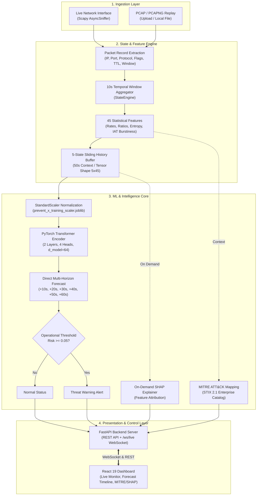

# ThreatForecast

<<<<<<< HEAD
**AI-based Network Attack Forecasting from Network Traffic Data**  
ThreatForecast is an intelligent defensive cybersecurity system that continuously processes raw network traffic, aggregates packet flows into 10-second temporal states with 45 statistical features, and applies a multi-horizon Transformer neural network to forecast cyber attack risks (+10s to +60s) before attacks manifest. The system provides real-time operator alerts, on-demand Explainable AI (SHAP) feature attribution, and automated MITRE ATT&CK technique mapping.

---

## 1. Problem Overview

Traditional Intrusion Detection and Prevention Systems (IDS/IPS) operate reactively: they flag malicious activity only during or after an attack has compromised the network boundary. This leaves security operation center (SOC) analysts and automated response pipelines with zero lead time to prevent data exfiltration, system degradation, or denial of service.

Network attacks rarely occur as isolated instantaneous events; reconnaissance scans, connection flooding, and protocol abuse exhibit measurable temporal warning signals across preceding traffic states. ThreatForecast addresses this challenge by shifting network defense from reactive signature matching to proactive temporal forecasting, predicting emerging threat probability across 6 discrete future time horizons (+10s, +20s, +30s, +40s, +50s, +60s) to enable preemptive defensive counteractions.

---

## 2. Solution Overview

ThreatForecast provides an end-to-end real-time defensive pipeline grounded in a frozen 45-feature temporal contract:

1. **Traffic Ingestion**: Ingests live network traffic via raw interface packet sniffing or deterministic PCAP/PCAPNG replays.
2. **10-Second State Binning**: Groups packets into genuine 10-second temporal windows. Empty windows are never artificially synthesized, preserving genuine traffic dynamics.
3. **45-Feature Engineering**: Computes 45 statistical, entropy, volume, protocol, and timing features per window.
4. **5-State Sliding History**: Maintains a sliding history of 5 consecutive occupied states (50 seconds total).
5. **Transformer Inference**: Scales the `(5, 45)` matrix via a fitted `StandardScaler` and passes it through a 2-layer TransformerEncoder to output 6 direct multi-horizon risk scores.
6. **Operational Alerting**: Compares risk scores against an operational threshold (`0.05`). Any horizon meeting or exceeding the threshold triggers an elevated warning alert.
7. **Explainable AI (SHAP)**: Offers on-demand permutation SHAP attribution over all 225 sequence positions `(5 × 45)` mapped back to the 45 features to explain *why* risk is elevated.
8. **MITRE ATT&CK Context**: Maps anomalous feature vectors against candidate adversary techniques (e.g., T1046 Network Service Scanning, T1498 Network DoS) using built-in catalogs and official STIX 2.1 Enterprise bundles.
9. **Operator Telemetry & Auditing**: Streams real-time packets, temporal state summaries, and model forecasts to an interactive web dashboard via WebSockets and structured console logging. *(Note: Auditing is maintained via in-memory ring buffers and structured application logs; external blockchain auditing is not implemented in this repository).*

---

## 3. Key Features

- **Direct Multi-Horizon Threat Forecasting**: Single Transformer model forecasting risk scores across six forward time horizons (+10s, +20s, +30s, +40s, +50s, +60s).
- **Frozen 45-Feature Contract**: 45 network traffic features covering packet rates, byte rates, flow pairs, TCP flags, TTL, window sizes, Shannon entropy (IP and port), and inter-arrival time (IAT) burstiness.
- **Strict 10-Second State Aggregation**: Genuinely binned packet windows requiring 5 consecutive occupied states (50s) before inference, avoiding synthetic padding.
- **Multiple Traffic Ingestion Modes**:
  - Live network interface capture using Scapy `AsyncSniffer`.
  - Client-side browser PCAP/PCAPNG upload with chunked and raw streaming support (up to 16 GiB).
  - Server-side PCAP replay with configurable speed multiplier.
  - Headless CLI replay tool (`python -m backend.app.cli replay <path>`).
- **Low-Latency WebSocket Streaming**: Persistent `/ws/live` channel streaming live packet metadata and forecast events directly to the frontend.
- **On-Demand SHAP Attribution**: Sequence-level permutation explanations cached via SHA-256 hashes to minimize computational overhead during active monitoring.
- **MITRE ATT&CK Intelligence Mapping**: Built-in heuristic candidate detection with a dedicated automated fetch script for the official STIX 2.1 Enterprise bundle.
- **Interactive React Dashboard**: High-performance dashboard built with React 19, Vite, Recharts, and Three.js with dedicated views for Live Monitoring, Network States, Forecasts, MITRE ATT&CK, and SHAP Explainability.
- **Production Artifact Verification**: Integrated pre-flight validation script (`verify_artifacts.py`) ensuring model weights, scaler, and configuration files match exact production contracts.

---

## 4. System Workflow

The end-to-end ThreatForecast operational lifecycle follows these steps:

1. **Packet Capture**: Packets are captured live from the selected network interface or ingested from a PCAP/PCAPNG file via Scapy.
2. **10s State**: Incoming packets are timestamp-binned into 10-second discrete windows (`StateEngine`).
3. **45 Features**: At each 10-second boundary, the feature engine calculates the 45 dimensional feature vector (`build_features`).
4. **5-State History**: States are pushed into a FIFO queue (`deque(maxlen=5)`). Forecasting requires 5 genuine occupied states (50 seconds of traffic history).
5. **Transformer**: The `(5, 45)` tensor is normalized using `prevent_x_training_scaler.joblib` and passed into the PyTorch Transformer encoder (`PREVENTXTransformer`).
6. **Threat Prediction**: The model emits 6 risk scores for +10s, +20s, +30s, +40s, +50s, and +60s.
7. **Alert / Response**: If any horizon risk score is $\ge 0.05$, a warning alert flag is set and broadcasted along with peak risk metrics.
8. **SHAP / Explainability**: Analysts can trigger on-demand SHAP explanations (`/api/explain`) to identify top contributing features for elevated risk horizons.
9. **MITRE ATT&CK**: The current feature vector is mapped to candidate tactics and techniques (e.g., discovery, denial of service) for actionable SOC context.

---

## 5. Project Architecture

### Component Breakdown

- **Frontend (`frontend/`)**: Single-page application built with React 19, Vite, Lucide icons, Recharts, and Three.js. Manages state via `ThreatContext` and receives asynchronous telemetry over WebSockets.
- **Backend API (`backend/app/`)**: FastAPI application served by Uvicorn. Implements REST endpoints for operational controls, file uploads, explainability queries, and a WebSocket broadcaster (`/ws/live`).
- **State & Feature Engine (`backend/app/state_engine.py`, `packet_features.py`)**: Responsible for packet-to-record conversion, 10-second sliding time windows, and calculation of the 45 mathematical and statistical features.
- **ML Inference Runtime (`backend/app/model.py`, `artifacts/`)**:
  - Model: PyTorch `PREVENTXTransformer` (Linear projection $45 \to 64$, positional encoding, 2-layer TransformerEncoder with 4 attention heads, LayerNorm, Linear $64 \to 6$, Sigmoid activation).
  - Scaler: scikit-learn `StandardScaler`.
  - Operational Threshold: Frozen at `0.05`.
- **Explainability Engine (`backend/app/services/explain.py`)**: Permutation explainer evaluating 225 sequence positions with SHA-256 caching.
- **Threat Intelligence Service (`backend/app/services/mitre.py`)**: Heuristic mapping engine referencing built-in technique definitions and `data/mitre/enterprise-attack.json`.
- **Data & Storage**: In-memory ring buffers (`deque(maxlen=200)` for history, `deque(maxlen=5)` for active states); local filesystem upload storage (`backend/runtime/uploads/`); no external database required.

### Architecture Diagram



---

## 6. Setup Instructions

### Prerequisites

- **Python**: Python 3.11 or higher (Docker uses `python:3.11-slim`; compatible with Python 3.11–3.13).
- **Node.js**: Node.js 18 or higher (LTS recommended) and `npm`.
- **Packet Capture Library (for Live Sniffing)**:
  - **Linux**: `libpcap` (`sudo apt-get install libpcap-dev`)
  - **Windows**: Npcap (installed in WinPcap API-compatible mode)
  - *Note: PCAP replay mode functions without raw packet capture drivers.*

---

### Step 1: Model Artifacts Verification

ThreatForecast relies on four production artifacts located inside the `artifacts/` folder:

- `artifacts/prevent_x_transformer_best.pt`
- `artifacts/prevent_x_training_scaler.joblib`
- `artifacts/prevent_x_transformer_architecture.json`
- `artifacts/prevent_x_operational_threshold.json`

Validate their integrity before starting the server:
=======
Defensive production prototype for the frozen PREVENT-X forecasting architecture.

```text
network packets
	-> genuine 10-second state
	-> 45 features
	-> five-state (50-second) history
	-> Transformer
	-> six direct risk forecasts (+10 to +60 seconds)
	-> threshold 0.05
	-> dashboard, SHAP explanations, and MITRE ATT&CK context
```

## Requirements

- Python 3.10 or newer
- Node.js 18 or newer and npm
- Packet-capture permissions for live capture mode
- The four model artifacts listed below

The package does not include Kaggle datasets or training arrays.

## Quick start

### 1. Install model artifacts

Place these files in `artifacts/`:

```text
prevent_x_transformer_best.pt
prevent_x_training_scaler.joblib
prevent_x_transformer_architecture.json
prevent_x_operational_threshold.json
```

### 2. Start the backend

From the repository root:

```bash
python -m venv .venv
# Windows PowerShell: .\.venv\Scripts\Activate.ps1
# Windows cmd:        .venv\Scripts\activate.bat
# macOS/Linux:        source .venv/bin/activate
python -m pip install -r backend/requirements.txt
python -m uvicorn backend.app.main:app --host 0.0.0.0 --port 8000
```

The API and interactive documentation are available at:

- API: <http://127.0.0.1:8000>
- Docs: <http://127.0.0.1:8000/docs>

### 3. Start the frontend

In a second terminal:
>>>>>>> origin/main

```bash
python scripts/verify_artifacts.py
```

<<<<<<< HEAD
Expected output:
```text
FOUND .../artifacts/prevent_x_transformer_best.pt
FOUND .../artifacts/prevent_x_training_scaler.joblib
FOUND .../artifacts/prevent_x_transformer_architecture.json
FOUND .../artifacts/prevent_x_operational_threshold.json
PASS threshold=0.05
PASS production artifacts present
Input contract: (5,45)
Output horizons: +10,+20,+30,+40,+50,+60s
```

---

### Step 2: Backend Setup & Execution

1. Create and activate a Python virtual environment:
   ```bash
   # Windows (PowerShell)
   python -m venv .venv
   .\.venv\Scripts\Activate.ps1

   # Windows (cmd.exe)
   python -m venv .venv
   .\.venv\Scripts\activate.bat

   # Linux / macOS
   python -m venv .venv
   source .venv/bin/activate
   ```

2. Install backend dependencies:
   ```bash
   pip install -r backend/requirements.txt
   ```

3. (Optional) Download official MITRE ATT&CK STIX 2.1 Enterprise bundle:
   ```bash
   python scripts/download_mitre.py
   ```

4. Start the backend:
   - **Using startup script (Windows)**:
     ```cmd
     start_backend.bat
     ```
   - **Using startup script (Linux/macOS)**:
     ```bash
     chmod +x start_backend.sh
     ./start_backend.sh
     ```
   - **Direct command**:
     ```bash
     uvicorn backend.app.main:app --host 0.0.0.0 --port 8000
     ```

The API will be available at `http://127.0.0.1:8000` with interactive Swagger docs at `http://127.0.0.1:8000/docs`.

---

### Step 3: Frontend Setup & Execution

1. Navigate to the frontend directory:
   ```bash
   cd frontend
   ```

2. Install npm dependencies:
   ```bash
   npm install
   ```

3. Start the Vite development server:
   - **Using startup script (from repository root)**:
     ```cmd
     start_frontend.bat     # Windows
     ./start_frontend.sh    # Linux/macOS
     ```
   - **Direct command (from `frontend/` directory)**:
     ```bash
     npm run dev
     ```

The React dashboard will be accessible at `http://localhost:5173` (or the port indicated by Vite).

---

### Step 4: Docker / Container Deployment

A complete containerized deployment for the backend is provided:
=======
Open the local URL printed by Vite, usually <http://localhost:5173>.

## Docker

The backend can also be started with Docker Compose:

```bash
docker compose up --build
```

This exposes the API on port `8000` and mounts `artifacts/` and `data/` into the container. Start the frontend separately with the commands above.

## Dashboard data sources

The dashboard supports three operating modes:

1. **Live capture**: read packets from an authorized local network interface.
2. **Controlled lab traffic**: generate traffic for an isolated demonstration environment.
3. **PCAP replay**: upload a `.pcap`, `.pcapng`, or `.cap` file from the browser.

For PCAP replay, the backend stores a temporary copy in `backend/runtime/uploads/` and starts replay automatically.

## MITRE ATT&CK context

A built-in contextual catalog is included. To download the current Enterprise STIX 2.1 bundle:
>>>>>>> origin/main

```bash
docker compose up --build
```

<<<<<<< HEAD
This builds from `Dockerfile` (`python:3.11-slim`), installs `libpcap-dev`, mounts `./artifacts` (read-only) and `./data`, and exposes port `8000`.

---

## 7. Configuration & Environment Variables

| Variable | Scope | Default Value | Description |
| :--- | :--- | :--- | :--- |
| `PREVENTX_ARTIFACTS_DIR` | Backend | `<project_root>/artifacts` | Directory containing model weights and schema JSON files. |
| `VITE_API_BASE_URL` | Frontend | `http://127.0.0.1:8000` | Base URL for REST API endpoints. |
| `VITE_API_BASE` | Frontend | `http://127.0.0.1:8000` | Fallback base URL for REST API endpoints. |
| `VITE_WS_BASE_URL` | Frontend | Derived from API base (`ws://127.0.0.1:8000`) | Base URL for real-time WebSocket connection. |

*Refer to the corresponding project configuration/file for any environment overrides.*

---

## 8. API & WebSocket Specifications

### REST Endpoints

| Method | Endpoint | Description |
| :--- | :--- | :--- |
| `GET` | `/api/health` | Service health status, model load status, threshold, and feature configurations. |
| `GET` | `/api/status` | Current runtime status, mode, total state count, and latest packet stream buffer. |
| `GET` | `/api/forecast/latest` | Most recent forecast containing 6 horizon risk scores and warning status. |
| `GET` | `/api/forecast/history` | Historical log of emitted forecasts (up to 200 states). |
| `GET` | `/api/mitre/candidates` | Candidate MITRE ATT&CK tactics and techniques evaluated from active network state. |
| `POST` | `/api/control/start` | Start live network interface capture (JSON body: `{"interface": "..."}`). |
| `POST` | `/api/control/stop` | Terminate active live capture or PCAP replay. |
| `POST` | `/api/control/replay` | Start server-side PCAP replay (JSON body: `{"path": "...", "speed": 1.0}`). |
| `POST` | `/api/control/replay-upload` | Multipart form-data PCAP file upload and replay. |
| `POST` | `/api/control/replay-upload-raw` | High-volume streamed raw octet PCAP upload and replay (up to 16 GiB). |
| `POST` | `/api/explain` | Generate SHAP explanations for specified horizon (JSON body: `{"horizon_seconds": 10, "max_evals": 600}`). |

### WebSocket Endpoint

| Protocol | Endpoint | Description |
| :--- | :--- | :--- |
| `WS` | `/ws/live` | Asynchronous real-time channel broadcasting `packet` and `forecast` JSON events. |

---

## 9. Operating Modes & Demonstration Guide

ThreatForecast supports three primary operation modes:

### Mode A: Deterministic PCAP Replay (Recommended for SIH Demonstration)
1. In the web dashboard, navigate to the **Live Monitor** or control panel.
2. Select and upload a `.pcap`, `.pcapng`, or `.cap` capture file.
3. Configure the replay speed multiplier (e.g., `1.0x` or faster).
4. The file is streamed to `backend/runtime/uploads/` and automatically replayed into the state engine.
5. Alternatively, run via the backend CLI:
   ```bash
   python -m backend.app.cli replay <path_to_file.pcap> --speed 1.0
   ```

### Mode B: Live Network Interface Sniffing
1. Ensure `libpcap` (Linux) or Npcap (Windows) is installed.
2. Provide the interface name (e.g., `eth0`, `Wi-Fi`) or leave empty for default.
3. Call `POST /api/control/start` or click **Start Live Capture** on the dashboard.

### Mode C: Controlled Lab Scenarios
As detailed in `lab/scenarios.md`:
- **Normal baseline**: standard ping/curl traffic across an isolated testbed.
- **Port Discovery**: bounded port-scanning traffic to evaluate detection and mapping of MITRE technique `T1046`.
- **Traffic Stress**: bounded `iperf3` bursts to evaluate detection and mapping of MITRE technique `T1498`.

---

## 10. Automated Tests & Verification

Verify the feature schema contract and the 5-state sliding engine:

```bash
python -c "import tests.test_features, tests.test_state_engine; tests.test_features.test_feature_schema(); tests.test_state_engine.test_five_states(); print('ALL TESTS PASSED')"
```

- `tests/test_features.py`: Asserts that `FEATURE_NAMES` contains exactly 45 features and computes finite values on packet inputs.
- `tests/test_state_engine.py`: Asserts that 5 discrete 10s states correctly formulate a `(5, 45)` numpy matrix.

---

## 11. Repository Structure

```text
ThreatForecast/
├── artifacts/                                # Production ML model artifacts
│   ├── prevent_x_transformer_best.pt         # PyTorch Transformer weights (70,406 params)
│   ├── prevent_x_training_scaler.joblib      # Fitted StandardScaler for 45 features
│   ├── prevent_x_transformer_architecture.json # Model hyperparameters (d_model=64, 2 layers, 4 heads)
│   ├── prevent_x_operational_threshold.json  # Operational decision threshold (0.05)
│   ├── prevent_x_production_45_feature_contract.json # 45-feature schema definitions
│   ├── prevent_x_production_45_feature_contract.csv
│   └── prevent_x_production_metadata.json    # Deployment specifications
├── backend/                                  # FastAPI backend
│   ├── app/
│   │   ├── config.py                         # Runtime constants and horizons
│   │   ├── main.py                           # API routes and WebSocket broadcaster
│   │   ├── model.py                          # PyTorch Transformer model & inference engine
│   │   ├── packet_features.py                # 45-feature extraction logic
│   │   ├── state_engine.py                   # 10s window aggregation & history buffer
│   │   ├── cli.py                            # Standalone PCAP replay CLI
│   │   └── services/
│   │       ├── runtime.py                    # Capture, replay, and broadcast orchestrator
│   │       ├── explain.py                    # On-demand SHAP explainer
│   │       └── mitre.py                      # MITRE ATT&CK contextual mapping
│   ├── requirements.txt                      # Python dependencies
│   └── runtime/uploads/                      # Temporary storage for uploaded PCAP files
├── data/
│   └── mitre/
│       ├── technique_catalog.json            # Base MITRE technique catalog
│       └── enterprise-attack.json            # Official STIX 2.1 bundle (downloaded)
├── frontend/                                 # React 19 + Vite dashboard
│   ├── src/
│   │   ├── api/api.js                        # Centralized API client
│   │   ├── components/                       # UI components (threat, network, forecast, mitre)
│   │   ├── context/ThreatContext.jsx         # React context & state management
│   │   ├── pages/                            # Dashboard, LiveMonitor, Forecast, Mitre, Explain
│   │   ├── services/websocket.js             # Live WebSocket client
│   │   └── styles/                           # Premium dark-theme CSS
│   ├── package.json                          # Node.js dependencies
│   └── vite.config.js                        # Vite build configuration
├── lab/
│   └── scenarios.md                          # Guidelines for lab traffic simulation
├── scripts/
│   ├── verify_artifacts.py                   # Artifacts and contract validator
│   └── download_mitre.py                     # Official MITRE STIX 2.1 bundle fetcher
├── tests/
│   ├── test_features.py                      # Unit test for 45-feature extraction
│   └── test_state_engine.py                  # Unit test for 10s temporal state aggregation
├── Dockerfile                                # Backend container definition
├── docker-compose.yml                        # Docker compose configuration
├── start_backend.bat                         # Windows backend startup batch script
├── start_backend.sh                          # Linux/macOS backend startup shell script
├── start_frontend.bat                        # Windows frontend startup batch script
├── start_frontend.sh                         # Linux/macOS frontend startup shell script
├── FEATURE_PARITY.md                         # Feature parity gate notes
└── README.md                                 # Technical documentation (this file)
```
=======
The bundle is saved as `data/mitre/enterprise-attack.json` and parsed by the MITRE service.

## Explainability

The `/api/explain` endpoint calculates on-demand SHAP permutation-style explanations over the 225 sequence positions: five states multiplied by 45 features. It then aggregates the results back to the frozen 45-feature contract. Explanation requests are more expensive than inference.

## Runtime behavior

- Forecasting starts only after five genuine occupied 10-second states exist.
- The state engine never invents empty states to fill missing intervals.
- Forecast outputs are **risk scores**, not calibrated probabilities.
- The production model is the original direct multi-horizon Transformer. The residual Transformer was an evaluation experiment and is not used here.

For deterministic demonstrations, use an isolated lab or replayed PCAP. Run all capture and replay workflows only in environments where you have authorization.
>>>>>>> origin/main
